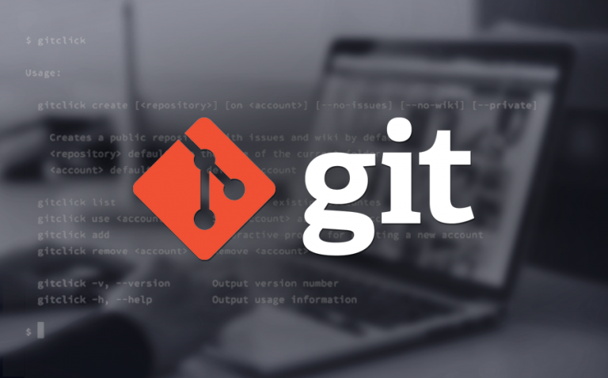
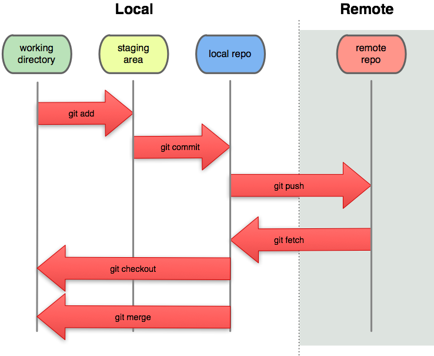

# Git Resumen 
## ¿Que es Git?

### Intro
Git es un _software_ de control de versiones diseñado por Linus Torvalds, pensando en la eficiencia, la confiabilidad y compatibilidad del mantenimiento de versiones de aplicaciones cuando estas tienen un gran número de archivos de código fuente. Su propósito es llevar registro de los cambios en archivos de computadora incluyendo coordinar el trabajo que varias personas realizan sobre archivos compartidos en un repositorio de código.
## Ventajas de usar Git 
- Estándar actual
- Código colaborativo, versionado y distribuido
- Recuperación de archivos
- Mayor control
- Shorcuts y plugins
- Mejora tu productividad
## Plataformas para usar Git 
- [GitHub](https://github.com)
- [GitLab](https://about.gitlab.com)
- [BitBucket](https://bitbucket.org)
## Configurando Git por primera vez
```Git
$ > git --version
$ > git config --global user.name "Jonathan MirCha"
$ > git config --global user.email jonmircha@gmail.com
$ > git config --global user.ui true
$ > git config --global core.editor nano
$ > git config --list
$ > git help [comando a buscar]
```
### Inicializar Git en un directorio local
```Git
$ > mkdir carpeta
$ > cd carpeta
$ > touch README.md
$ > touch .gitignore
$ > git init
$ > git status
```

